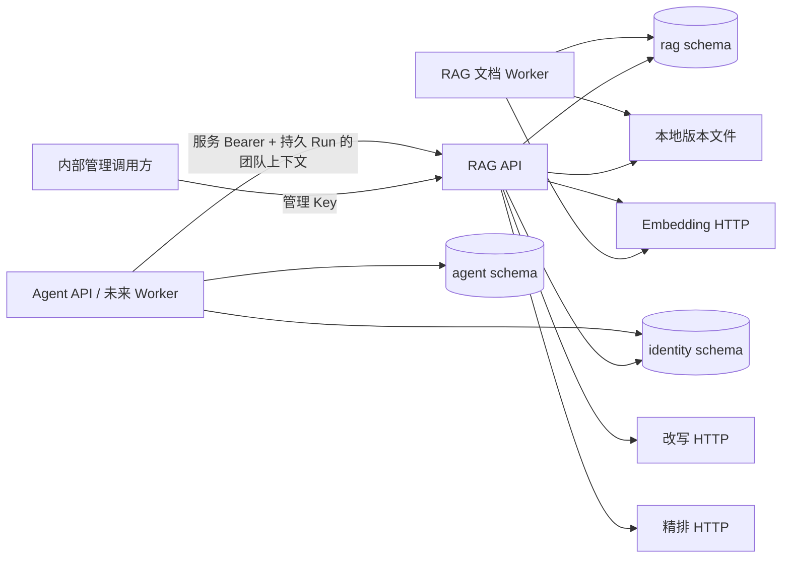

# 当前架构

文档上传先保存文件、版本和 PostgreSQL 任务。Worker 认领任务、解析并准备片段及当前/影子 revision 向量，完成后在一个事务中发布新 active 版本。查询从当前 active revision 开始，在 SQL 候选阶段限定逻辑文档的当前 ACL 与 active 版本；按证据 ID 读取同样执行当前 ACL，但可读取仍获授权的旧版本片段。影子 revision 全量覆盖当前 active 片段后，使用 `index_state` 行锁与文档发布串行化，一次切换全局指针。
