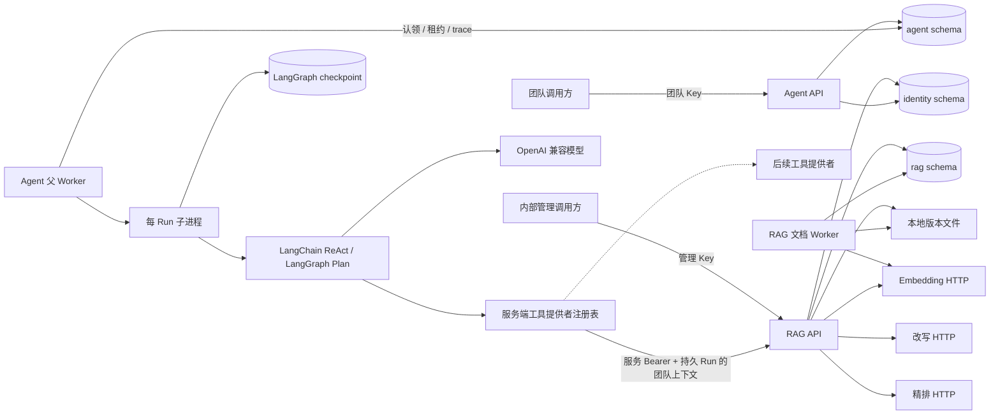

# 当前架构

文档上传先保存文件、版本和 PostgreSQL 任务。Worker 认领任务、解析并准备片段及当前/影子 revision 向量，完成后在一个事务中发布新 active 版本。查询从当前 active revision 开始，在 SQL 候选阶段限定逻辑文档的当前 ACL 与 active 版本；按证据 ID 读取同样执行当前 ACL，但可读取仍获授权的旧版本片段。影子 revision 全量覆盖当前 active 片段后，使用 `index_state` 行锁与文档发布串行化，一次切换全局指针。

Agent API 只创建、查询和取消持久 Run。父 Worker 用数据库租约维持全局并发槽位，并监督每个 Run 的独立子进程。子进程运行可恢复图，但每次模型或工具调用都先在业务表预留预算并写入 `started`；checkpoint 与调用记录不能证明结果已知时不会重放。工具由部署配置的提供者注册表加载，统一接收来自持久 Run 的身份上下文、预算和 trace，RAG 只是当前默认提供者。最终生成在独立节点完成，事务内验证引用、保存被引用片段快照并发布终态。业务 trace 不读取 checkpoint，也不保存完整 prompt 或模型输出。
