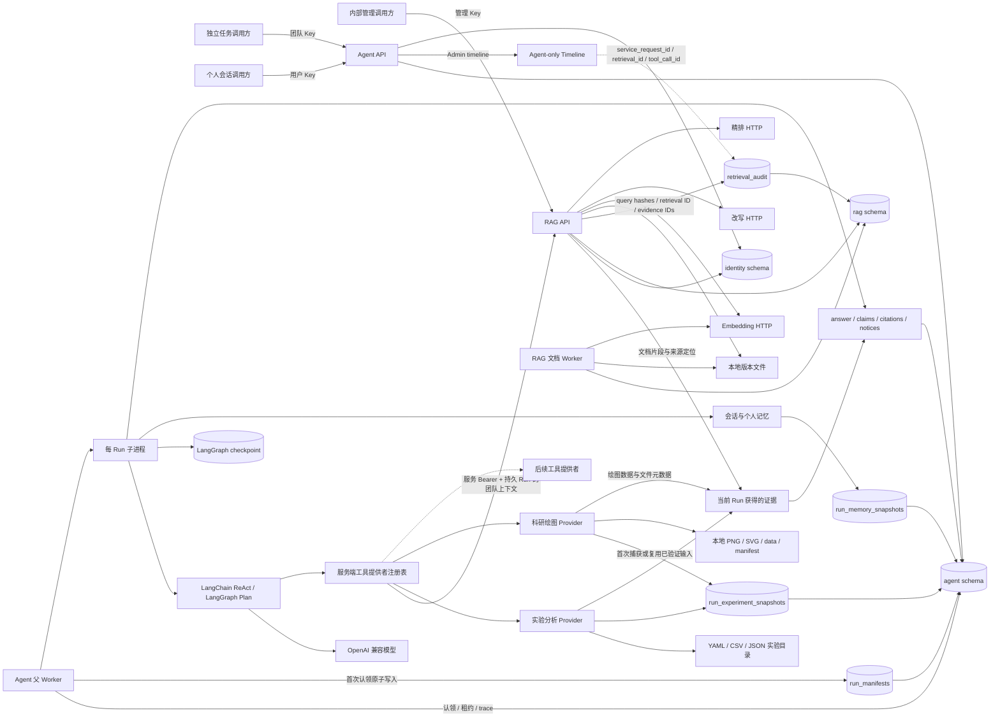

# 当前架构

面向个人科研工作流的可扩展 Agent 执行与证据分析平台，以自动调制识别的文献检索和实验对比为首个应用场景。Agent Runtime 承载持久任务与工具扩展；当前内置 RAG、实验分析和科研绘图三个 Provider，共十个工具。完整定位和边界见[项目能力现状](platform-capability-assessment.md)。

## 在线执行与数据边界

```mermaid
flowchart LR
    Admin[内部管理调用方] -->|管理 Key| RAG[RAG API]
    Client[独立任务调用方] -->|团队 Key| AgentAPI[Agent API]
    Personal[个人会话调用方] -->|用户 Key| AgentAPI
    AgentAPI --> AD[(agent schema)]
    AgentAPI -->|Admin timeline| Timeline[Agent-only Timeline]
    AgentWorker[Agent 父 Worker] -->|认领 / 租约 / trace| AD
    AgentWorker -->|首次认领原子写入| Manifest[(run_manifests)]
    Manifest --> AD
    AgentWorker --> Child[每 Run 子进程]
    Child --> Graph[LangChain ReAct / LangGraph Plan]
    Graph --> Model[OpenAI 兼容模型]
    Graph --> Registry[服务端工具提供者注册表]
    Registry -->|服务 Bearer + 持久 Run 的团队上下文| RAG
    Registry --> Experiments[实验分析 Provider]
    Experiments --> ExperimentFiles[YAML / CSV / JSON 实验目录]
    Experiments --> ExperimentSnapshot[(run_experiment_snapshots)]
    ExperimentSnapshot --> AD
    Registry --> Plots[科研绘图 Provider]
    Plots -->|首次捕获或复用已验证输入| ExperimentSnapshot
    Plots --> PlotFiles[本地 PNG / SVG / data / manifest]
    Experiments --> Evidence[当前 Run 获得的证据]
    Plots -->|绘图数据与文件元数据| Evidence
    RAG -->|文档片段与来源定位| Evidence
    Registry -.-> More[后续工具提供者]
    RAG --> ID[(identity schema)]
    RAG --> RD[(rag schema)]
    RAG -->|query hashes / retrieval ID / evidence IDs| Audit[(retrieval_audit)]
    Audit --> RD
    RAG --> Files[本地版本文件]
    Worker[RAG 文档 Worker] --> RD
    Worker --> Files
    Worker --> Embed[Embedding HTTP]
    RAG --> Embed
    RAG --> Rewrite[改写 HTTP]
    RAG --> Rerank[精排 HTTP]
    AgentAPI --> ID
    Child --> CP[(LangGraph checkpoint)]
    Child --> Memory[会话与个人记忆]
    Memory --> MemorySnapshot[(run_memory_snapshots)]
    MemorySnapshot --> AD
    Child --> Result[answer / claims / citations / notices]
    Evidence --> Result
    Result --> AD
    Timeline -.->|service_request_id / retrieval_id / tool_call_id| Audit
```

团队是授权和资料隔离边界；个人部署可用一个团队承载自己的科研空间。用户 Key 只用于自己的会话和记忆，团队 Key 用于独立 Run。科研项目目前由实验根目录及 YAML 的 `run.project_id` 标识，还没有独立项目管理层。

## 文档检索

文档上传先保存文件、版本和 PostgreSQL 任务。Worker 认领任务、解析并准备片段及当前/影子 revision 向量，完成后在一个事务中发布新 active 版本。查询从当前 active revision 开始，在 SQL 候选阶段限定逻辑文档的当前 ACL 与 active 版本；按证据 ID 读取同样执行当前 ACL，但可读取仍获授权的旧版本片段。影子 revision 全量覆盖当前 active 片段后，使用 `index_state` 行锁与文档发布串行化，一次切换全局指针。

文献及研究记录支持 PDF、DOCX、Markdown、TXT。RAG Provider 通过 HTTP 调用独立证据服务，Agent 运行账号不读取 RAG schema。实验 YAML/CSV/JSON 的结构化分析走实验 Provider。

## 实验分析

实验 Provider 在 Agent Run 子进程内执行，`experiment_service/catalogue.py` 是共享分析模块。启用时由服务端绑定一个团队与一个实验根目录；每次工具调用核对持久 Run 的团队、租约和状态，模型参数不能指定文件根目录或身份。

首次工具调用读取约定的合成 YAML/CSV/JSON 格式，保存配置、已核对的结果计数、混淆矩阵、状态及文件哈希到不可变 `agent.run_experiment_snapshots`。并发首次调用在 Run 行锁与唯一键下选用同一份快照；后续步骤和恢复读取快照，新 Run 才重新登记。该记录是每 Run 输入快照，尚未形成跨 Run 常驻实验库。

六个实验工具支持配置精确检索、详情、配置差异、严格对照、样本加权准确率比较和错分统计。返回的实验证据包含项目与实验 ID、源文件相对路径和 SHA-256、快照哈希、方法和版本、合成标志。与文档证据共用 `Evidence`、claims 与引用发布流程，来源类型由 `source_locator.kind` 区分。真实数据适配和真实文献/实验联动质量仍需验证。

## 科研绘图

独立 `experiment_plots` Provider 提供准确率–SNR 曲线和混淆矩阵，复用原实验方法版本 `2` 的输入快照。Agent 与离线 `scripts.experiment_plot_demo` 共用 `experiment_service/plotting.py`，绘图 Provider 和绘图证据方法版本为 `1`。模型仅提供实验 ID、可选 SNR 与归一化方式；根目录、团队、Run、样式与发布位置均由服务端控制。

曲线支持 1–5 个 `ready` 实验，核对完整数据集、评测配置和各 SNR×类别样本数，按正确数与样本数计算加权准确率，披露其余有效配置差异。混淆矩阵行为真实类别、列为预测类别，按已验证类别顺序展示；汇总多个 SNR 时先累加计数，再进行可选的行归一化。图片和证据均注明合成属性与描述性结果限制。

输出位于实验输入目录之外的本地根目录，在线按 `<team_id>/<run_id>/<plot_id>/` 保存 PNG、矢量 SVG、`data.json` 和 `manifest.json`。Matplotlib 固定为 `3.11.2`，渲染在进程内串行执行。先验证身份与租约、准备临时文件，发布前再次锁定 Run 并核对租约和执行期限，再原子发布完整目录。重复调用校验清单与文件哈希后复用，损坏时拒绝覆盖；失败清理本次临时目录。

绘图工具声明为 `side_effect` 且产生证据，沿用预算、trace 和 checkpoint。来源 locator 仍指向原实验文件；证据内容保存绘图数据及文件相对路径、媒体类型、大小和哈希，图片字节保存在本地。恢复从工具消息取回证据与产物元数据。文件系统与数据库没有统一事务，强制中断或发布后的数据库失败可能留下未引用目录。配置、大小限制与错误处理见[绘图说明](experiment-plots.md)。

## 执行、记忆与结果发布

Agent API 管理持久 Run、分页列表、个人会话和记忆查询，并提供管理员 trace、Timeline、队列概览及 Worker 状态。父 Worker 用数据库租约维持全局并发槽位，并监督每个 Run 的独立子进程；首次认领在同一数据库事务中写入不可变的 Execution Manifest，恢复沿用原记录。子进程运行可恢复图，但每次模型或工具调用都先在业务表预留预算并写入 `started`；图调用成功返回后才将已经结算的调用标记为已进入 checkpoint，恢复时只接受不存在 `started` 或未确认调用的 Run。

工具由部署配置的 Provider 注册表加载，统一接收可信身份上下文、预算和 trace。会话 Run 还固定历史轮次、摘要和相关个人陈述快照；个人记忆是历史上下文，不作为论文或实验引用依据。后台提取和摘要任务独立于 Run 的调用次数预算。

最终生成在图外完成，因此不会被标记为可恢复；事务内验证引用 ID、保存实际被引用的文档或实验结果证据快照并发布终态。原文件变化不改变已发布引用。ID 完整性校验不等于已经证明文本结论的语义支持性；这部分需要真实任务评估。

## 诊断与验证

Admin Timeline 将 Run、Manifest 捕获、步骤、模型调用、工具调用、结果发布和终态映射为稳定顺序的事件，仅读取 Agent schema。RAG 的检索审计独立保存 query 哈希、检索关联 ID 和最终 evidence ID；第一版通过 `service_request_id`、`retrieval_id`、`tool_call_id` 关联两侧，不引入 Agent→RAG 的在线时间线依赖。Manifest 与审计均不保存服务秘密，审计也不保存原始 query。

实验分析工具的 trace 记录操作、来源数量、快照哈希和 evidence ID；绘图工具还记录 plot ID 与产物元数据。业务 trace 采用安全摘要，checkpoint、输入快照和最终引用内容可能保存完整配置或消息。`db.doctor` 检查连接、迁移、权限、checkpoint、索引、租约、Worker 状态、调用及文件一致性；readiness 与 Worker 心跳分别提供 API 数据库就绪和父 Worker 在线情况。

2026-10-08 本机真实 PostgreSQL/pgvector 科研专项 68 项通过，全量 299 项通过，均为 0 失败、0 错误、0 跳过。原实验 3 个、绘图 2 个、合成资料联动 2 个核心数据库场景全部实际执行通过。联动测试保留真实文档上传、Worker、检索 SQL、ACL 和审计，以脚本化模型或 Mock 替换模型组件，在最终生成前中断并用新租约恢复两类证据和绘图元数据。未调用真实模型，未验证真实模型自主工具选择。详见[验收记录](validation-status.md)。

## 文件输出与后续应用层

在线入口返回 Run JSON，绘图工具生成本地图片、数据与清单，通过现有引用内容提供产物元数据和相对路径。相对路径应结合服务端绘图根目录查看。离线 `scripts.experiment_fixture_demo` 生成 Markdown 报告和 CSV 比较文件，`scripts.experiment_plot_demo` 生成同口径图片。在线报告导出、权限受控下载 API、个人工作台和多项目管理仍待后续扩展。
